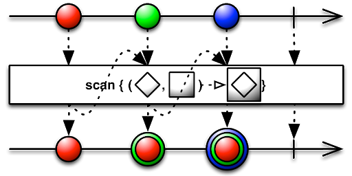

# MVI Architecture with Android

앱 개발에 왜 아키텍쳐를 사용하는지에 대한 이해가 있는가?  
팀에서 사용하는 아키틱쳐에 이해가 팀원 모두 동일한 수준인가?  
팀에서 사용한 아키텍쳐를 올바르게 사용하고 있는가?  
  
  

### Background


사용자와의 인터렉션은 기존 서비스보다 훨씬 많아졌다. 그로 인해서 많은 버그가 발생하게 되었고 수 많은 양방향의 데이터 흐름 때문에 버그를 수정 하기도 힘들었다

MVC 패턴의 큰 특징 중 하나가 ‘양방향 데이터 흐름’이다. 모델이 변경된다면 뷰 또한 변경되고, 사용자에 의해 뷰에서 변경이 일어난다면 모델 또한 변경된다. 이러한 양방향 데이터 흐름은 설계하기 간단하고 코드 작성하기 쉬운 장점이 있다. 하지만 애플케이션 규모가 커진다면 문제가 생긴다. 한 개의 모델이 여러 개의 뷰를 조작하고 한 개의 뷰가 여러 개의 모델을 조작한다면 데이터 흐름을 이해하기 힘들어진다. 버그를 찾기 어려워지고 데이터 흐름을 추적하는 데 많은 시간을 투자해야 한다.  
  
 
    
    
### Unidirectional data flow architecture 

Unidirectional data flow architecture   
Flux, Redux, MVI  
  
#### 1. Flux
Flux: Facebook이 만든 단방향 아키텍쳐  
> https://haruair.github.io/flux/

View — Action — Dispacther — Store. 
  
Dispatcher는 EventBus, Otto, RxBus 등으로 구현할 수 있는 전역 이벤트 전달자 

#### 2. Redux
Redux: Redux는 Flux에서 고안한 State 관리 라이브러리
> https://ko.redux.js.org/

2015년에는 Dan Abramov에 의해서 React + Flux의 구조에 ‘Reducer’를 결합한 ‘Redux’가 등장하게 된다.  
  
`Redux = (Red)ucer + Fl(ux)`  
View — Action — Middleware — Reducer — Store  
  
  
View에서 일어나는 이벤트는 직접 데이터(상태)를 변경해서는 안됨  
이벤트(Action) 을 Reducer로 전달할 뿐, 데이터의 변경은 Reducer 만 가능  
Reducer 이외의 공간에서는 데이터(상태)는 읽기모드  
  
데이터가 **집중화(Centralized)** 되어 있어서 **예측 가능하며(Predictable)**   
데이터 흐름이 단방향이라서 **디버깅하기 쉽다(Debuggable)**  
또한 필요에 맞게 **유연하게(Flexible)** 구현할 수 있다.  
  
  
### MVI Architecture

Hannes Dorfmann  
> http://hannesdorfmann.com/android/mosby3-mvi-1   
> https://github.com/sockeqwe/mosby  
> https://github.com/sockeqwe/mosby/tree/master/sample-mvi
  
Model — 모델은 상태, MVI의 모델은 아키텍쳐의 다른 레이어와의 단방향 데이터 흐름을 보장하기 위해 변경이 불가능  
View  — View를 나타내며 하나 이상의 Activity나 Fragment로 구현  
Intent — 사용자 또는 앱내 발생하는 Action을 나타냄  
  
    
1.  View에 영향을 주는 State는 한 방향으로만 수정할 수 있다 —  **단방향**
2.  앞 액션이 끝난 후 뒤 액션을 실행한다 —  **동기적 실행**
3.  Model은 State를 변화시키고 View는 State를 참조만 한다 —  **View와 State 분리**
 

| flux              | redux               | mvi                 |
|-------------------|---------------------|---------------------|
| Action 명시        | Action 명시          | Action 없음          |
| Dispatcher 있음    | Dispatcher 없음      | Dispatcher 없음      | 
| Multiple store    | Single store        | Multiple store      |
| Business in Store | Business in Reducer | Business in Model   |
| Mutable State     | Immutable State     | Immutable State     |
  
#### 장점
-   **상태의 충돌이 없습니다**  상태는 하나 뿐이라서
-   **단방향 데이터 흐름을 갖습니다**  로직이 예측가능하고 이해하기 쉽움
-   **불변성** 각각의 출력값이 불변값이기 때문에 불변성이 갖는 쓰레드 안전성
-   **디버그의 용이함** 단방향 데이터 흐름은 앱을 쉽게 디버깅
-   **분리된 로직**  각각의 컴포넌트는 자체적으로 책임
-   **Testability** 

#### 단점
-   **너무 많은 상용구** — 작은 UI 변경도 intent 로 시작하여 한 사이클을 통과함, 아주 간단한 구현도 intent와 state가 필요
-   **복잡성** — 내부엔 많은 규칙이 있어야하며 하고 모든 사람이 엄격하게 따라야함, 하지만 새로운 사람은 그런걸 알기 쉽지 않기때문에 팀이 확장 되면서 문제가 발생 할 수 있음
-   **객체 생성**
    
### MVI Sample

> https://github.com/sockeqwe/mosby/tree/master/sample-mvi

Mvi Presenter  
```java
public interface MviPresenter<V extends MvpView, VS> extends MvpPresenter<V> {

}
```
  
ProductDetailsPresenter    
```java
public class ProductDetailsPresenter
    extends MviBasePresenter<ProductDetailsView, ProductDetailsViewState> {
 
  private final DetailsInteractor interactor;
 
  public ProductDetailsPresenter(DetailsInteractor interactor) {
    this.interactor = interactor;
  }
 
  @Override protected void bindIntents() {
 
    intent(ProductDetailsView::addToShoppingCartIntent)
        .doOnNext(product -> Timber.d("intent: add to shopping cart %s", product))
        .flatMap(product -> interactor.addToShoppingCart(product).toObservable()).subscribe();
 
    intent(ProductDetailsView::removeFromShoppingCartIntent)
        .doOnNext(product -> Timber.d("intent: remove from shopping cart %s", product))
        .flatMap(product -> interactor.removeFromShoppingCart(product).toObservable())
        .subscribe();
 
    Observable<ProductDetailsViewState> loadDetails =
        intent(ProductDetailsView::loadDetailsIntent)
            .doOnNext(productId -> Timber.d("intent: load details for product id = %s", productId))
            .flatMap(interactor::getDetails)
            .observeOn(AndroidSchedulers.mainThread());
 
    subscribeViewState(loadDetails, ProductDetailsView::render);
  }
}
```

HomePresenter
```java
  @Override protected void bindIntents() {
 
    Observable<PartialStateChanges> loadFirstPage = intent(HomeView::loadFirstPageIntent).doOnNext(
        ignored -> Timber.d("intent: load first page"))
        .flatMap(ignored -> feedLoader.loadFirstPage()
            .map(items -> (PartialStateChanges) new PartialStateChanges.FirstPageLoaded(items))
            .startWith(new PartialStateChanges.FirstPageLoading())
            .onErrorReturn(PartialStateChanges.FirstPageError::new)
            .subscribeOn(Schedulers.io()));
 
    Observable<PartialStateChanges> nextPage =
        intent(HomeView::loadNextPageIntent).doOnNext(ignored -> Timber.d("intent: load next page"))
            .flatMap(ignored -> feedLoader.loadNextPage()
                .map(items -> (PartialStateChanges) new PartialStateChanges.NextPageLoaded(items))
                .startWith(new PartialStateChanges.NextPageLoading())
                .onErrorReturn(PartialStateChanges.NexPageLoadingError::new)
                .subscribeOn(Schedulers.io()));
 
    Observable<PartialStateChanges> pullToRefresh = intent(HomeView::pullToRefreshIntent).doOnNext(
        ignored -> Timber.d("intent: pull to refresh"))
        .flatMap(ignored -> feedLoader.loadNewestPage()
            .subscribeOn(Schedulers.io())
            .map(items -> (PartialStateChanges) new PartialStateChanges.PullToRefreshLoaded(items))
            .startWith(new PartialStateChanges.PullToRefreshLoading())
            .onErrorReturn(PartialStateChanges.PullToRefeshLoadingError::new));
 
    Observable<PartialStateChanges> loadMoreFromGroup =
        intent(HomeView::loadAllProductsFromCategoryIntent).doOnNext(
            categoryName -> Timber.d("intent: load more from category %s", categoryName))
            .flatMap(categoryName -> feedLoader.loadProductsOfCategory(categoryName)
                .subscribeOn(Schedulers.io())
                .map(
                    products -> (PartialStateChanges) new PartialStateChanges.ProductsOfCategoryLoaded(
                        categoryName, products))
                .startWith(new PartialStateChanges.ProductsOfCategoryLoading(categoryName))
                .onErrorReturn(
                    error -> new PartialStateChanges.ProductsOfCategoryLoadingError(categoryName,
                        error)));
 
    Observable<PartialStateChanges> allIntentsObservable =
        Observable.merge(loadFirstPage, nextPage, pullToRefresh, loadMoreFromGroup)
            .observeOn(AndroidSchedulers.mainThread());
 
    HomeViewState initialState = new HomeViewState.Builder().firstPageLoading(true).build();
 
    subscribeViewState(
        allIntentsObservable
        .scan(initialState,this::viewStateReducer)
        .distinctUntilChanged(),
        HomeView::render);
  }
```

mobsy MVI 는 RxJava 로 State 변경/관리 를 구현
```java
Observable<PartialStateChanges> aObservable = RxView.clicks(findViewById(R.id.button_a))  
      .share()  
      .map(ignore -> new PartialStateChanges("a"));  
  
Observable<PartialStateChanges> bObservable = RxView.clicks(findViewById(R.id.button_b))  
      .share()  
      .map(ignore -> new PartialStateChanges("b"));  
  
Observable<PartialStateChanges> cObservable = RxView.clicks(findViewById(R.id.button_c))  
      .share()  
      .map(ignore -> new PartialStateChanges("c"));  
  
Observable<PartialStateChanges> allObservable = Observable.merge(aObservable, bObservable, cObservable)  
      .observeOn(AndroidSchedulers.mainThread());  
  
ViewState initialState = new ViewState();  
  
Disposable disposable = allObservable.scan(initialState, this::viewStateReducer)  
      .distinctUntilChanged()  
      .subscribe(viewState -> Log.e("test", viewState.getSet().toString()));
```
> merge()  
> Observable들을 merge시켜 하나로 결합  
  

> scan()  
> 이전 처리로 반환된 값이 첫 번째 인수, 다음 값이 두 번째 인수로 전달  
> 상태 누적 값을 계속 변화시킨 방법으로 사용  
  

> distinctUntilChanged()  
> 같은 원소인지 비교해서 다른 원소일때에만 이벤트 방출  
  
<!--stackedit_data:
eyJoaXN0b3J5IjpbLTk3MTYzMDE5OSwtNzM4Mjc4NzcsLTc2MD
Y5ODMyOCwxOTQ3NDg4NzQwLDE1MTE0NTc2MjgsLTE2MDUyMzA0
NDgsLTI3MzU2NTc5OSw3MDQ1MTQ1MzgsMTkyNTY4NDk0NiwzOD
Q3NjI4MDAsODMyNTE3MTk1LDc2NDI2NjE1NCwyMDk1NzcwODg2
LC0zNjg3OTg2NTAsMTA2NjYxOTUxMiwxODg5ODI5NzI0LDE4OD
I2NjI0MDAsNzA5NTUxODQ1LC02NDgwNTc5NTQsMTQyMDE5Mzgw
MF19
-->