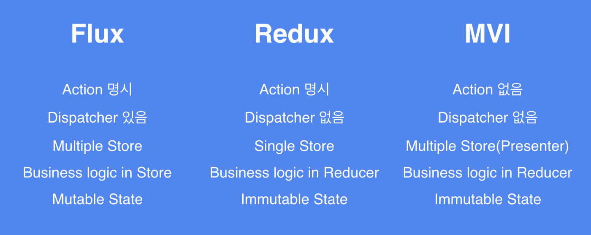

# MVI Architecture with Android

### Background

사용자와의 인터렉션 또한 기존 서비스보다 훨씬 많아졌다. 그로 인해서 많은 버그가 발생하게 되었고 수 많은 양방향의 데이터 흐름 때문에 버그를 수정하기도 힘들었다

MVC 패턴의 큰 특징 중 하나가 ‘양방향 데이터 흐름’이다. 모델이 변경된다면 뷰 또한 변경되고, 사용자에 의해 뷰에서 변경이 일어난다면 모델 또한 변경된다. 이러한 양방향 데이터 흐름은 설계하기 간단하고 코드 작성하기 쉬운 장점이 있다. 하지만 애플케이션 규모가 커진다면 문제가 생긴다. 한 개의 모델이 여러 개의 뷰를 조작하고 한 개의 뷰가 여러 개의 모델을 조작한다면 데이터 흐름을 이해하기 힘들어진다. 버그를 찾기 어려워지고 데이터 흐름을 추적하는 데 많은 시간을 투자해야 한다.  
  
 
  
  
### Unidirectional data flow architecture 

Unidirectional data flow architecture   
Flux, Redux, MVI  
  
#### Flux
Flux: Facebook이 만든 단방향 아키텍쳐  
> https://haruair.github.io/flux/

View — Action — Dispacther — Store. 
  
Dispatcher는 EventBus, Otto, RxBus 등으로 구현할 수 있는 전역 이벤트 전달자 

#### Redux
Redux: Redux는 Flux에서 고안한 State 관리 라이브러리
> https://ko.redux.js.org/

2015년에는 Dan Abramov에 의해서 React + Flux의 구조에 ‘Reducer’를 결합한 ‘Redux’가 등장하게 된다.  
  
`Redux = (Red)ucer + Fl(ux)`  
View — Action — Middleware — Reducer — Store  
  
  
View에서 일어나는 이벤트는 직접 데이터(상태)를 변경해서는 안됨  
이벤트(Action) 을 Reducer로 전달할 뿐, 데이터의 변경은 Reducer 만 가능  
Reducer 이외의 공간에서는 데이터(상태)는 읽기모드  
  
데이터가 **집중화(Centralized)** 되어 있어서 **예측 가능하며(Predictable)**   
데이터 흐름이 단방향이라서 **디버깅하기 쉽다(Debuggable)**  
또한 필요에 맞게 **유연하게(Flexible)** 구현할 수 있다.  
  
  
### MVI Architecture

Hannes Dorfmann  
> http://hannesdorfmann.com/android/mosby3-mvi-1   
> https://github.com/sockeqwe/mosby  
> https://github.com/sockeqwe/mosby/tree/master/sample-mvi
  
Model — 모델은 상태, MVI의 모델은 아키텍쳐의 다른 레이어와의 단방향 데이터 흐름을 보장하기 위해 변경이 불가능  
View  — View를 나타내며 하나 이상의 Activity나 Fragment로 구현  
Intent — 사용자 또는 앱내 발생하는 Action을 나타냄  
  
    
1.  View에 영향을 주는 State는 한 방향으로만 수정할 수 있다 —  **단방향**
2.  앞 액션이 끝난 후 뒤 액션을 실행한다 —  **동기적 실행**
3.  Model은 State를 변화시키고 View는 State를 참조만 한다 —  **View와 State 분리**
  
  

| flux              | redux               | mvi                 |
|-------------------|---------------------|---------------------|
| Action 명시        | Action 명시          | Action 없음          |
| Dispatcher 있음    | Dispatcher 없음      | Dispatcher 없음      | 
| Multiple store    | Single store        | Multiple store      |
| Business in Store | Business in Reducer | Business in Reducer |
| Mutable State     | Immutable State     | Immutable State     |

### MVI Sample
https://github.com/sockeqwe/mosby/tree/master/sample-mvi

<!--stackedit_data:
eyJoaXN0b3J5IjpbLTE3NDk4MTk0MjQsLTM2ODc5ODY1MCwxMD
Y2NjE5NTEyLDE4ODk4Mjk3MjQsMTg4MjY2MjQwMCw3MDk1NTE4
NDUsLTY0ODA1Nzk1NCwxNDIwMTkzODAwLDE0MjI0MDgyOTIsLT
YxMjcyMjg0NCwtMTYwNzc3MTc0MCwtMTA0NjI2NzU4LC0yMDkw
MTY2OTk1LC00NDU5ODEyNjAsODgxNDE5NjExLC0xOTA3MzMyOT
RdfQ==
-->